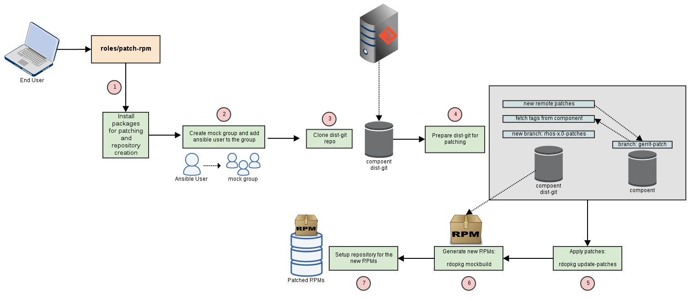

# Octario

**Openstack Component Testing Ansible Roles**

Octario is a collection of Ansible roles and playbooks for testing Openstack Components on RHEL/CentOS.

It supports the following testers:

* PEP8
* unit
* functional
* API

Coming Soon: Tempest.

### Requirements

1. ansible installed on the system ( ansible >= 2 ).
2. Component source code. Can be downloaded using `git clone git://git.openstack.org/openstack/<component_name>.git`.

Note: `octario` is not provisioning the node on which it will run the tests. It's assumed
      that the tester node is provided by the user by specifing it in the hosts file.

## Run Octario

First, create an inventory file that will include the IP address or the hostname of your tester node.

```
vi hosts

[tester]
my_tester_host
```

Edit octario.cfg with your component details. Make sure to specify name and version!

```
component:
  name: nova
  version: 9
```

Run octario!. Choose one of testers and run the following command in octario root directory

```
ansible-playbook -vvv -i hosts playbooks/pep8.yml --extra-vars @octario.cfg
```

pep8.yml can be replaced with [unittest, functional, api, scenario].yml

### Custom tester

You can specify your own tester

```
export TESTER=my_new_cool_tester
ansible-playbook -vvv -i hosts playbooks/custom-tester.yml --extra-vars @octario.cfg
```

### External ROLES

You can use external role with `octario`.

```
cp -r new_role octario/roles
export ROLE=new_role
ansible-playbook -vvv -i hosts playbooks/custom-role.yml --extra-vars @octario.cfg
```

## How it works

The following drawing added to simplify work-flow overview of `octario` for simple testers
as pep8, unittest and functional.

<div align="center"></div><hr />

### Patch RPMs

The following drawing describes specifically how RPM patching done with Octario.

To inclue patch_rpm role, run playbooks/<tester>-with-patching.yml

<div align="center"></div><hr />

## More Docs

See the [/doc](https://github.com/redhat-openstack/octario/tree/master/doc) directory of this repo.
